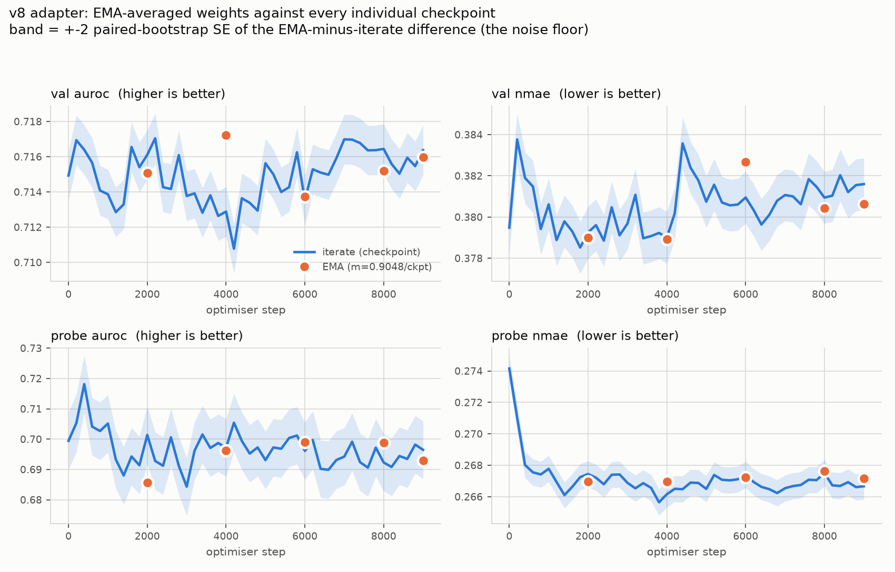
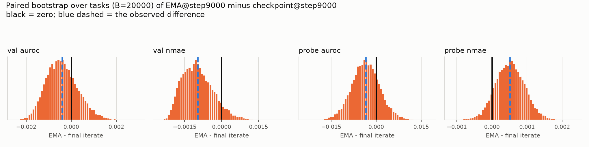
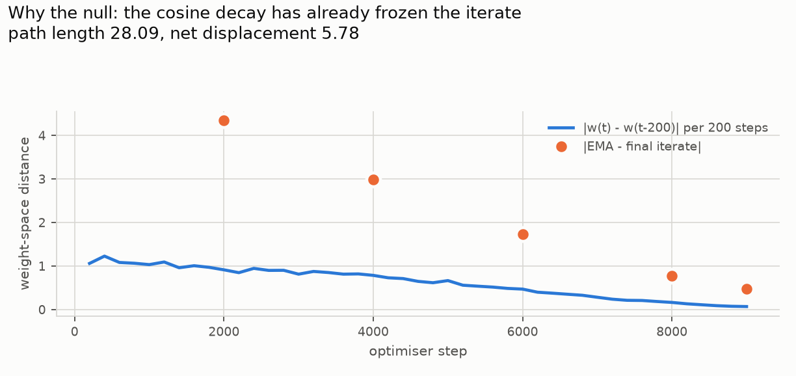

# Retrospective EMA (Polyak-Ruppert) averaging of the v8 adapter checkpoints

Generated by `make_swa_report.py` on 2026-09-22 10:20 PDT from
`/lfs/local/0/vedanga/scratch/relational-transformer/repaper/adapter/swa-eval-v8/results.json` (repo commit `b418c19db61f`). **Do not hand-edit** - rerun the
script. Every number in the prose below is read from the tables in this file.

## Verdict

**Averaging does not help.** Over 46 checkpoints of v8 and five EMA horizons,
3 of 40 paired differences clear zero on both the
task-level and the database-cluster bootstrap - 2 is what
40 uncorrected tests at the 5% level produce by chance - and they do not
even agree on which way the EMA is better: 1 favours it and 2
favour the iterate (val auroc at step 4000 (+0.0043, for the EMA); probe reg loss at step 4000 (+0.0145, against the EMA); val reg loss at step 8000 (+0.0153, against the EMA)). Nothing survives that as evidence. On the
headline numbers the EMA at step 9000 scores val auroc
0.7160 against the final checkpoint's
0.7164
(delta -0.0004 +- 0.0007)
and val nmae 0.3806 against
0.3816
(delta -0.0010 +- 0.0006).
On the reading the question was posed with - *if the averaged weights beat
every individual checkpoint there is signal under the noise; if they do not,
there probably is not* - they do not, so there probably is not.

The stronger statement the table supports is that **nothing in this run moves
any metric**: across all 46 checkpoints, from the random 512->64 projection at
step 0 to step 9000, val auroc spans
0.7108-0.7170
(sd 0.0015) while the head weight travels
5.78 in L2 from its initialisation. That is v7's finding again, at 3.6x
the step count and 5x the peak learning rate.

## Context: what this result speaks to

The measured per-step gradient signal-to-noise ratio is ~0.95 even at 512
independent task draws, so the iterate sits in a noise ball and Polyak-Ruppert
averaging is the standard answer. The completed sibling run **v7** (job 192013,
2500 steps, flat lr 1e-4) moved `dist_from_init` to 1.156 with no statistically
significant change in training loss in either task type, and val auroc drifted
slightly *down*, -0.0020 +- 0.0003. The question this evaluation answers is
whether there is real signal being drowned by that gradient noise.

**v8** (job 192079, the run read here) is v7 at 10000 steps on a cosine
schedule from 5e-4 to 1e-5 - 4x the steps and 5x the peak lr - and it travels
5.78 rather than 1.156. **v9** (job 192368, the same with a 1e-3 peak) was
still training and is not read here. So the answer below is for the largest
weight-space excursion of the three, which is the most favourable case for
finding signal if any exists.

## What was averaged, and the momentum

The scheme is rt-j's own, `rt.train.swa.SwaState`, not one invented here.

- `src/rt/train/_train.py:920` - `swa.update(master.items())`, once per
  optimiser step, unconditionally, on the fp32 master **parameters**. There is
  no warmup gate and no start-step.
- `src/rt/train/_train.py:391` - `SwaState(master.items(), momentum=swa_momentum)`,
  constructed from the initial weights.
- `src/rt/train/swa.py:12-25` - the update is bias-corrected:
  `self.n += 1`; `alpha = (1.0 - m) / (1.0 - m**self.n)`; `target.lerp_(src[name].float(), alpha)`.
  At `n=1` that is `alpha=1`, so the state it was constructed from is discarded
  entirely by the first update, and after `n` updates the weight on update `i`
  is proportional to `m**(n-i)`.
- `src/rt/train/_train.py:657,758` - `swa.sync_to(swa_net.named_parameters())`:
  **parameters only; buffers are never averaged.** That is exactly the split
  here - the adapter's only parameter is `head.weight` and `Standardize`'s
  `mean`/`scale` are buffers.
- `expts/pretrain/submit_ilc.py:57` - `swa_momentum=0.9995`.

**Checked, not assumed:** the `Standardize` buffers are bit-identical across
all 46 checkpoints - max |delta| = 0.0 for
`mean` and 0.0 for `scale` - so averaging
`head.weight` alone is the whole of the average.

**Horizon-matched momentum = 0.904815.** Derivation:
under `alpha = (1-m)/(1-m**n)` the weight on update `i` is proportional to
`m**(n-i)`, i.e. geometric with ratio `m` per optimiser step; the checkpoints
are 200 steps apart, so one checkpoint-level update must decay
the old value by the same factor 200 per-step updates would,
`m**200 = 0.9995**200 = 0.904815`.
The bias correction renormalises and does not change the horizon. Effective
window `1/(1-m)` = 2000 steps = 10.51 checkpoints.
The literal-0.9995-per-checkpoint variant was **not** run.

**Caveat on the approximation.** Compounding assumes the weights move smoothly
between snapshots, so an EMA over 200-step-spaced checkpoints is a coarse
sampling of the true per-step EMA, not equal to it. On a synthetic drifting
random walk matched to this trajectory's length the two differ by ~1.4% in L2.
This is the conservative direction: a future run with the real in-loop EMA may
do somewhat better than this retrospective estimate. It does not rescue the
conclusion here, because the gap to be closed is not small - it is zero.

## Table 1: every weight set

46 individual checkpoints (steps 0-9000, every 200) and the EMA at five
horizons. `n avg` is `SwaState.n`, the number of checkpoint-level updates
folded in. Losses are the training objective (cross-entropy for clf, the
TabPFN bar-distribution NLL for reg; the reg loss is negative by construction).
auroc is higher-better; nmae and both losses are lower-better.

| weight set | n avg | val clf loss | val auroc | val reg loss | val nmae | probe clf loss | probe auroc | probe reg loss | probe nmae |
|---|---|---|---|---|---|---|---|---|---|
| `ckpt_step0` | 1 | 0.4027 | 0.7149 | -2.4449 | 0.3795 | 0.3674 | 0.6994 | -2.3017 | 0.2742 |
| `ckpt_step200` | 1 | 0.4019 | 0.7169 | -2.4484 | 0.3838 | 0.3663 | 0.7053 | -2.3752 | 0.2710 |
| `ckpt_step400` | 1 | 0.4008 | 0.7164 | -2.4457 | 0.3819 | 0.3659 | 0.7181 | -2.4021 | 0.2680 |
| `ckpt_step600` | 1 | 0.4024 | 0.7157 | -2.4285 | 0.3815 | 0.3655 | 0.7041 | -2.4141 | 0.2675 |
| `ckpt_step800` | 1 | 0.4028 | 0.7141 | -2.4350 | 0.3794 | 0.3651 | 0.7027 | -2.4214 | 0.2674 |
| `ckpt_step1000` | 1 | 0.4032 | 0.7139 | -2.4438 | 0.3806 | 0.3659 | 0.7051 | -2.4234 | 0.2678 |
| `ckpt_step1200` | 1 | 0.4027 | 0.7129 | -2.4385 | 0.3789 | 0.3665 | 0.6933 | -2.4275 | 0.2669 |
| `ckpt_step1400` | 1 | 0.4029 | 0.7133 | -2.4406 | 0.3798 | 0.3658 | 0.6880 | -2.4314 | 0.2661 |
| `ckpt_step1600` | 1 | 0.4014 | 0.7166 | -2.4407 | 0.3793 | 0.3653 | 0.6942 | -2.4286 | 0.2666 |
| `ckpt_step1800` | 1 | 0.4007 | 0.7154 | -2.4462 | 0.3785 | 0.3661 | 0.6914 | -2.4269 | 0.2672 |
| `ckpt_step2000` | 1 | 0.4010 | 0.7161 | -2.4315 | 0.3793 | 0.3659 | 0.7014 | -2.4313 | 0.2674 |
| `ckpt_step2200` | 1 | 0.4008 | 0.7170 | -2.4217 | 0.3796 | 0.3662 | 0.6928 | -2.4319 | 0.2672 |
| `ckpt_step2400` | 1 | 0.4015 | 0.7143 | -2.4319 | 0.3789 | 0.3664 | 0.6912 | -2.4338 | 0.2668 |
| `ckpt_step2600` | 1 | 0.4021 | 0.7142 | -2.4290 | 0.3805 | 0.3658 | 0.7006 | -2.4340 | 0.2674 |
| `ckpt_step2800` | 1 | 0.4028 | 0.7161 | -2.4319 | 0.3791 | 0.3659 | 0.6912 | -2.4412 | 0.2674 |
| `ckpt_step3000` | 1 | 0.4033 | 0.7138 | -2.4253 | 0.3797 | 0.3657 | 0.6843 | -2.4341 | 0.2669 |
| `ckpt_step3200` | 1 | 0.4025 | 0.7139 | -2.4234 | 0.3811 | 0.3652 | 0.6962 | -2.4344 | 0.2665 |
| `ckpt_step3400` | 1 | 0.4032 | 0.7128 | -2.4299 | 0.3790 | 0.3652 | 0.7015 | -2.4354 | 0.2669 |
| `ckpt_step3600` | 1 | 0.4029 | 0.7138 | -2.4092 | 0.3791 | 0.3658 | 0.6971 | -2.4373 | 0.2666 |
| `ckpt_step3800` | 1 | 0.4033 | 0.7126 | -2.4131 | 0.3792 | 0.3653 | 0.6987 | -2.4389 | 0.2656 |
| `ckpt_step4000` | 1 | 0.4026 | 0.7129 | -2.4065 | 0.3790 | 0.3656 | 0.6972 | -2.4432 | 0.2662 |
| `ckpt_step4200` | 1 | 0.4035 | 0.7108 | -2.4173 | 0.3802 | 0.3658 | 0.7054 | -2.4430 | 0.2665 |
| `ckpt_step4400` | 1 | 0.4024 | 0.7136 | -2.4221 | 0.3836 | 0.3662 | 0.6994 | -2.4439 | 0.2665 |
| `ckpt_step4600` | 1 | 0.4029 | 0.7134 | -2.4117 | 0.3824 | 0.3659 | 0.6952 | -2.4464 | 0.2669 |
| `ckpt_step4800` | 1 | 0.4033 | 0.7129 | -2.4066 | 0.3818 | 0.3663 | 0.6972 | -2.4500 | 0.2669 |
| `ckpt_step5000` | 1 | 0.4018 | 0.7156 | -2.4159 | 0.3807 | 0.3663 | 0.6931 | -2.4406 | 0.2665 |
| `ckpt_step5200` | 1 | 0.4022 | 0.7150 | -2.4004 | 0.3816 | 0.3662 | 0.6972 | -2.4387 | 0.2674 |
| `ckpt_step5400` | 1 | 0.4035 | 0.7140 | -2.4106 | 0.3807 | 0.3663 | 0.6968 | -2.4416 | 0.2671 |
| `ckpt_step5600` | 1 | 0.4034 | 0.7143 | -2.4075 | 0.3806 | 0.3665 | 0.7004 | -2.4491 | 0.2670 |
| `ckpt_step5800` | 1 | 0.4020 | 0.7162 | -2.4052 | 0.3806 | 0.3659 | 0.7012 | -2.4481 | 0.2671 |
| `ckpt_step6000` | 1 | 0.4034 | 0.7135 | -2.4226 | 0.3809 | 0.3659 | 0.6961 | -2.4482 | 0.2674 |
| `ckpt_step6200` | 1 | 0.4029 | 0.7153 | -2.4222 | 0.3803 | 0.3659 | 0.6997 | -2.4489 | 0.2669 |
| `ckpt_step6400` | 1 | 0.4034 | 0.7151 | -2.4250 | 0.3796 | 0.3658 | 0.6902 | -2.4487 | 0.2666 |
| `ckpt_step6600` | 1 | 0.4032 | 0.7150 | -2.4239 | 0.3801 | 0.3664 | 0.6899 | -2.4480 | 0.2665 |
| `ckpt_step6800` | 1 | 0.4026 | 0.7159 | -2.4269 | 0.3808 | 0.3658 | 0.6931 | -2.4496 | 0.2662 |
| `ckpt_step7000` | 1 | 0.4023 | 0.7170 | -2.4260 | 0.3811 | 0.3660 | 0.6942 | -2.4477 | 0.2665 |
| `ckpt_step7200` | 1 | 0.4019 | 0.7170 | -2.4309 | 0.3810 | 0.3658 | 0.6991 | -2.4474 | 0.2667 |
| `ckpt_step7400` | 1 | 0.4020 | 0.7168 | -2.4262 | 0.3806 | 0.3658 | 0.6924 | -2.4472 | 0.2667 |
| `ckpt_step7600` | 1 | 0.4023 | 0.7164 | -2.4308 | 0.3818 | 0.3657 | 0.6906 | -2.4509 | 0.2671 |
| `ckpt_step7800` | 1 | 0.4022 | 0.7164 | -2.4273 | 0.3815 | 0.3657 | 0.6972 | -2.4506 | 0.2671 |
| `ckpt_step8000` | 1 | 0.4022 | 0.7164 | -2.4319 | 0.3809 | 0.3659 | 0.6923 | -2.4501 | 0.2675 |
| `ckpt_step8200` | 1 | 0.4023 | 0.7156 | -2.4370 | 0.3810 | 0.3657 | 0.6908 | -2.4498 | 0.2667 |
| `ckpt_step8400` | 1 | 0.4025 | 0.7150 | -2.4361 | 0.3820 | 0.3655 | 0.6944 | -2.4527 | 0.2667 |
| `ckpt_step8600` | 1 | 0.4021 | 0.7159 | -2.4403 | 0.3812 | 0.3658 | 0.6935 | -2.4501 | 0.2669 |
| `ckpt_step8800` | 1 | 0.4023 | 0.7155 | -2.4387 | 0.3815 | 0.3658 | 0.6982 | -2.4515 | 0.2666 |
| `ckpt_step9000` | 1 | 0.4020 | 0.7164 | -2.4376 | 0.3816 | 0.3655 | 0.6965 | -2.4491 | 0.2667 |
| `ema_at_step2000` | 10 | 0.4021 | 0.7151 | -2.4607 | 0.3790 | 0.3658 | 0.6856 | -2.4278 | 0.2670 |
| `ema_at_step4000` | 20 | 0.4018 | 0.7172 | -2.4254 | 0.3789 | 0.3649 | 0.6963 | -2.4288 | 0.2670 |
| `ema_at_step6000` | 30 | 0.4031 | 0.7137 | -2.4106 | 0.3827 | 0.3660 | 0.6989 | -2.4450 | 0.2672 |
| `ema_at_step8000` | 40 | 0.4025 | 0.7152 | -2.4166 | 0.3804 | 0.3658 | 0.6988 | -2.4471 | 0.2676 |
| `ema_at_step9000` | 45 | 0.4021 | 0.7160 | -2.4280 | 0.3806 | 0.3657 | 0.6930 | -2.4476 | 0.2672 |

## Table 2: EMA minus the iterate at the same step, paired bootstrap

The comparison that matters is paired: the same tasks, the same context and
query rows, only the weights differ. Resampling is over **tasks**, B=20000. For
val the table also reports a cluster bootstrap that resamples the 7 databases,
because three or four tasks from one database are not independent draws.
"clears 0?" is yes only when the task-level **and** the db-cluster interval both
exclude zero.

| comparison | metric | delta | bootstrap SE | 95% CI (task) | 95% CI (db-cluster) | clears 0? |
|---|---|---|---|---|---|---|
| `ema_at_step2000` - `ckpt_step2000` | val clf loss | +0.0012 | 0.0008 | [-0.0000, +0.0030] | [-0.0003, +0.0038] | no |
| `ema_at_step2000` - `ckpt_step2000` | val auroc | -0.0010 | 0.0017 | [-0.0047, +0.0020] | [-0.0064, +0.0031] | no |
| `ema_at_step2000` - `ckpt_step2000` | val reg loss | -0.0291 | 0.0144 | [-0.0601, -0.0042] | [-0.0768, +0.0002] | no |
| `ema_at_step2000` - `ckpt_step2000` | val nmae | -0.0002 | 0.0013 | [-0.0025, +0.0025] | [-0.0034, +0.0035] | no |
| `ema_at_step2000` - `ckpt_step2000` | probe clf loss | -0.0001 | 0.0005 | [-0.0011, +0.0010] | n/a | no |
| `ema_at_step2000` - `ckpt_step2000` | probe auroc | -0.0158 | 0.0121 | [-0.0423, +0.0034] | n/a | no |
| `ema_at_step2000` - `ckpt_step2000` | probe reg loss | +0.0035 | 0.0048 | [-0.0055, +0.0134] | n/a | no |
| `ema_at_step2000` - `ckpt_step2000` | probe nmae | -0.0005 | 0.0008 | [-0.0019, +0.0011] | n/a | no |
| `ema_at_step4000` - `ckpt_step4000` | val clf loss | -0.0008 | 0.0007 | [-0.0023, +0.0004] | [-0.0026, +0.0005] | no |
| `ema_at_step4000` - `ckpt_step4000` | val auroc | +0.0043 | 0.0014 | [+0.0017, +0.0072] | [+0.0013, +0.0079] | yes |
| `ema_at_step4000` - `ckpt_step4000` | val reg loss | -0.0189 | 0.0144 | [-0.0505, -0.0006] | [-0.0743, +0.0019] | no |
| `ema_at_step4000` - `ckpt_step4000` | val nmae | -0.0001 | 0.0016 | [-0.0029, +0.0034] | [-0.0039, +0.0046] | no |
| `ema_at_step4000` - `ckpt_step4000` | probe clf loss | -0.0007 | 0.0007 | [-0.0021, +0.0006] | n/a | no |
| `ema_at_step4000` - `ckpt_step4000` | probe auroc | -0.0009 | 0.0087 | [-0.0183, +0.0162] | n/a | no |
| `ema_at_step4000` - `ckpt_step4000` | probe reg loss | +0.0145 | 0.0065 | [+0.0025, +0.0280] | n/a | yes |
| `ema_at_step4000` - `ckpt_step4000` | probe nmae | +0.0008 | 0.0007 | [-0.0005, +0.0021] | n/a | no |
| `ema_at_step6000` - `ckpt_step6000` | val clf loss | -0.0003 | 0.0003 | [-0.0009, +0.0002] | [-0.0009, +0.0002] | no |
| `ema_at_step6000` - `ckpt_step6000` | val auroc | +0.0002 | 0.0008 | [-0.0012, +0.0018] | [-0.0019, +0.0023] | no |
| `ema_at_step6000` - `ckpt_step6000` | val reg loss | +0.0121 | 0.0155 | [-0.0111, +0.0467] | [-0.0166, +0.0661] | no |
| `ema_at_step6000` - `ckpt_step6000` | val nmae | +0.0017 | 0.0014 | [-0.0011, +0.0044] | [-0.0023, +0.0049] | no |
| `ema_at_step6000` - `ckpt_step6000` | probe clf loss | +0.0000 | 0.0004 | [-0.0008, +0.0009] | n/a | no |
| `ema_at_step6000` - `ckpt_step6000` | probe auroc | +0.0028 | 0.0032 | [-0.0029, +0.0096] | n/a | no |
| `ema_at_step6000` - `ckpt_step6000` | probe reg loss | +0.0032 | 0.0043 | [-0.0052, +0.0114] | n/a | no |
| `ema_at_step6000` - `ckpt_step6000` | probe nmae | -0.0002 | 0.0006 | [-0.0014, +0.0010] | n/a | no |
| `ema_at_step8000` - `ckpt_step8000` | val clf loss | +0.0003 | 0.0001 | [+0.0000, +0.0006] | [-0.0001, +0.0007] | no |
| `ema_at_step8000` - `ckpt_step8000` | val auroc | -0.0013 | 0.0010 | [-0.0034, +0.0004] | [-0.0047, +0.0009] | no |
| `ema_at_step8000` - `ckpt_step8000` | val reg loss | +0.0153 | 0.0039 | [+0.0079, +0.0230] | [+0.0052, +0.0259] | yes |
| `ema_at_step8000` - `ckpt_step8000` | val nmae | -0.0005 | 0.0010 | [-0.0022, +0.0016] | [-0.0025, +0.0026] | no |
| `ema_at_step8000` - `ckpt_step8000` | probe clf loss | -0.0002 | 0.0003 | [-0.0008, +0.0004] | n/a | no |
| `ema_at_step8000` - `ckpt_step8000` | probe auroc | +0.0065 | 0.0072 | [-0.0035, +0.0229] | n/a | no |
| `ema_at_step8000` - `ckpt_step8000` | probe reg loss | +0.0030 | 0.0025 | [-0.0019, +0.0081] | n/a | no |
| `ema_at_step8000` - `ckpt_step8000` | probe nmae | +0.0001 | 0.0006 | [-0.0010, +0.0014] | n/a | no |
| `ema_at_step9000` - `ckpt_step9000` | val clf loss | +0.0001 | 0.0004 | [-0.0008, +0.0009] | [-0.0009, +0.0009] | no |
| `ema_at_step9000` - `ckpt_step9000` | val auroc | -0.0004 | 0.0007 | [-0.0016, +0.0011] | [-0.0017, +0.0014] | no |
| `ema_at_step9000` - `ckpt_step9000` | val reg loss | +0.0096 | 0.0050 | [+0.0009, +0.0202] | [-0.0018, +0.0247] | no |
| `ema_at_step9000` - `ckpt_step9000` | val nmae | -0.0010 | 0.0006 | [-0.0020, +0.0004] | [-0.0021, +0.0012] | no |
| `ema_at_step9000` - `ckpt_step9000` | probe clf loss | +0.0002 | 0.0003 | [-0.0004, +0.0008] | n/a | no |
| `ema_at_step9000` - `ckpt_step9000` | probe auroc | -0.0035 | 0.0047 | [-0.0126, +0.0061] | n/a | no |
| `ema_at_step9000` - `ckpt_step9000` | probe reg loss | +0.0015 | 0.0023 | [-0.0030, +0.0061] | n/a | no |
| `ema_at_step9000` - `ckpt_step9000` | probe nmae | +0.0005 | 0.0004 | [-0.0003, +0.0013] | n/a | no |

Of 40 tests, 3 clear zero on both intervals, against
2 expected by chance with no multiplicity correction, and
they split 1 for the EMA and 2 against it. They also disagree
in sign across horizons - val reg loss reads -0.0291
at step 2000 and +0.0096 at step 9000.
A real effect does not change sign with the horizon.

## Table 3: the noise floor

Three different uncertainties, which are not interchangeable:

- **between-task SE of the mean** - the standard error of the per-task mean for
  one weight set, resampling tasks. This is large because tasks differ
  enormously from each other. It is the right uncertainty for "what is val
  auroc", and the *wrong* one for "did averaging change it".
- **spread over the 46 checkpoints** - the sd of the per-checkpoint mean across
  the whole run. This is the scale of everything training did.
- **paired SE, EMA vs iterate** - the standard error of the *difference*,
  resampling tasks, with the per-task pairing kept. This is the noise floor a
  difference has to clear, and it is 40-100x smaller than the first column
  because the between-task variance cancels.

| metric | n tasks | final ckpt value | between-task SE of the mean | spread over 46 ckpts (min / max / sd) | paired SE, EMA vs iterate |
|---|---|---|---|---|---|
| val clf loss | 12 | 0.4020 | 0.0587 | 0.4007 / 0.4035 / 0.0007 | 0.0004 |
| val auroc | 12 | 0.7164 | 0.0301 | 0.7108 / 0.7170 / 0.0015 | 0.0007 |
| val reg loss | 9 | -2.4376 | 0.5721 | -2.4484 / -2.4004 / 0.0123 | 0.0050 |
| val nmae | 9 | 0.3816 | 0.0824 | 0.3785 / 0.3838 / 0.0012 | 0.0006 |
| probe clf loss | 26 | 0.3655 | 0.0404 | 0.3651 / 0.3674 / 0.0004 | 0.0003 |
| probe auroc | 26 | 0.6965 | 0.0395 | 0.6843 / 0.7181 / 0.0058 | 0.0047 |
| probe reg loss | 69 | -2.4491 | 0.2377 | -2.4527 / -2.3017 / 0.0249 | 0.0023 |
| probe nmae | 69 | 0.2667 | 0.0333 | 0.2656 / 0.2742 / 0.0013 | 0.0004 |

## Why the null, mechanically

Polyak-Ruppert averaging pays off when the iterate is bouncing around a
stationary point at roughly constant step size. v8 runs a cosine schedule from
5e-4 to 1e-5 over 10000 steps, and by step 9000 it has already stopped moving:
the per-200-step displacement falls from
1.0592 at the start to 0.0683 over the last interval, a factor of
16. The EMA over the last ~10 checkpoints therefore sits
0.4807 from the final iterate, against a total
trajectory displacement of 5.78 - the decay has already done the
averaging, and there is almost nothing left for an EMA to remove.

The trajectory itself is close to a random walk: path length 28.09
against net displacement 5.78 (ratio 0.206, versus
0.149 for a pure random walk of 45 steps). So
the picture is consistent - a mostly undirected walk, 5.8 units long, that
changes no metric, and an averaging scheme applied at the one point in the
schedule where it has the least to do.

## Validation of the measurement itself

- The val numbers here come from `loss_and_pred`, the same call
  `evaluate_relbench` makes. Running the library function on the same weights
  reproduces them exactly: `evaluate_relbench` gives clf
  0.7163736607 / reg
  0.3815975164, this script's per-task
  aggregation gives clf 0.7163736607 / reg
  0.3815975164.
- The v8 training run's own monitor logged `step 9500 relbench val: auroc
  0.7156 nmae 0.3818`; this evaluation of `adapter_step9000` gives
  0.7164 / 0.3816.

## What could not be measured

- **Test.** Nothing here touches test; `labels_relbench` carries no test row,
  so it cannot. All RelBench numbers are val.
- **A true per-step EMA.** Only 200-step snapshots exist; see the caveat above.
- **Whether an in-loop EMA under a flat schedule would help.** v8's cosine
  decay confounds the question: the answer here is "no, at the end of a decayed
  cosine". A constant-lr arm is the experiment that would separate them.
- **Raw per-row predictions.** The result object stores per-task loss and
  metric for every weight set, not the per-query-row predictions and labels, so
  a different metric cannot be recomputed from it without rerunning the job.
- **v9.** Job 192368 (cosine peak 1e-3) was still training; its checkpoints
  were not read.

## Provenance

`swa_v8_provenance.csv`, one row per run attempt. There was one eval attempt
and no failures; the second row is the training run that produced the
checkpoints. **One node and one commit per row**; the eval ran entirely on
`ampere3` at commit `b418c19d`, so no table here mixes hardware or code.

- Result objects: `swa_v8_result.pkl` (this directory) and the job's own
  `/lfs/local/0/vedanga/scratch/relational-transformer/repaper/adapter/swa-eval-v8/results.json`.
- Slurm logs, submitted arguments and the dependency lock:
  `/lfs/local/0/vedanga/scratch/relational-transformer/repaper/adapter/slurm-logs` - files `26-09-22_09-33-10_633757306_192860.out`,
  `26-09-22_09-33-10_633757306.args.json`, `26-09-22_09-33-10_633757306.pixi.lock`.
- Checkpoints read: `/lfs/local/0/vedanga/scratch/ckpts/rtv2/adapter/join-v8-ddp-proj64-cosine`, `adapter_step0.pt` through
  `adapter_step9000.pt`, every 200 steps, 46 files. **v8 was still
  training when this ran** - it was at step ~9520 of 10000 (~15.9 h of a ~17 h
  run) and has since written further checkpoints; only the 46 that
  existed at 09:36 on 2026-09-22 were read, and nothing was written to that
  directory.
- Eval configuration: fp32 estimators (`make_ests(..., n_features=64, "fp32")`),
  `relbench_n_ctx=8192`, `relbench_n_query=4096`, `seed=0`, matching the
  training run's own val monitor; training-distribution probe of 96 sampled
  tasks at `probe_seed=1234`, `n_ctx=1024`, `n_query=256`, `min_rows=512`, of
  which 95
  survived the degeneracy filters
  (26 clf, 69 reg);
  12 clf and 9 reg
  val tasks over 7 databases.
- Input paths: features `~/scratch/hf/relational-transformer/repaper/features_join_u12`;
  standardiser stats `~/scratch/hf/relational-transformer/repaper/feature_stats_join_u12.npz`;
  relbench preprocessed `~/scratch/hf/stanford-star/relbench-preprocessed`;
  relbench features `~/scratch/hf/relational-transformer/repaper/features_rt-j`;
  relbench labels `~/scratch/hf/relational-transformer/repaper/labels_relbench`;
  TabPFN `~/scratch/hf/relational-transformer/repaper/tabpfn`.
- Reproduce: `PYTHONPATH=. pixi run -e default python expts/repaper/adapter/submit_swa_eval.py`
  then `PYTHONPATH=. pixi run -e default python expts/repaper/adapter/results/make_swa_report.py`.
